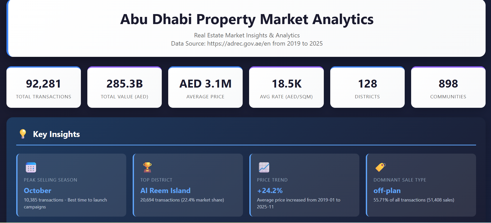
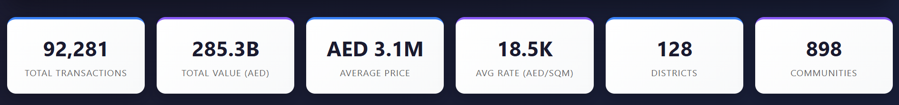
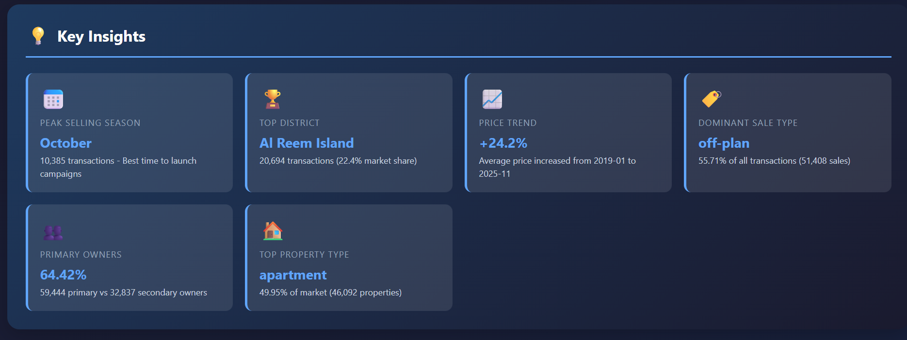
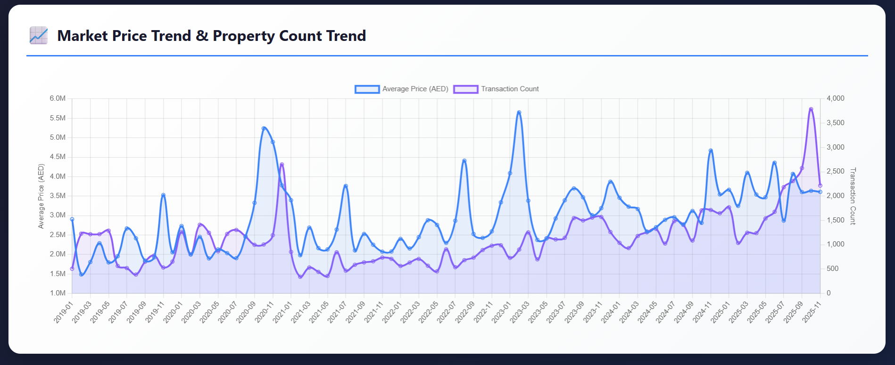
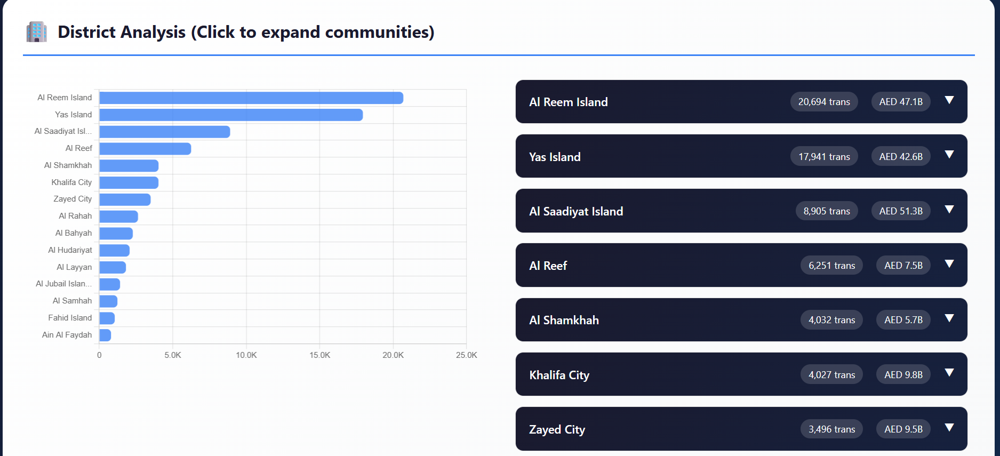

# Abu Dhabi Property Market Analytics Dashboard

An interactive analytics dashboard analyzing **92,000+ real estate transactions** in Abu Dhabi, featuring market trends, campaign targeting insights, and district-level drill-downs.



## 🔗 Live Demo

**[View Live Dashboard](https://sujataprabhakar.github.io/Abu-Dhabi-Property-Market-Analysis/)**

---

## 📊 Features

### Key Insights
- Peak selling season identification
- Top performing districts
- Price trend analysis
- Sale type distribution
- Primary vs Secondary owner ratio
- Most popular property types

### Interactive Visualizations
- **Market Trends**: Dual-axis chart showing price trends and transaction volume over time
- **Peak Seasons**: Monthly transaction distribution to identify best campaign periods
- **Campaign Targeting**: Top 5 districts with peak months for targeted marketing
- **Sale Type Distribution**: Off-plan vs Ready vs Court-mandated breakdown
- **Owner Distribution**: Primary vs Secondary market analysis
- **District Drill-Down**: Expandable hierarchy with community-level details
- **Layout Analysis**: Most popular property layouts in top 5 districts
- **Property Type Distribution**: Market segmentation by property type

---

## 📈 Data Summary

| Metric | Value |
|--------|-------|
| **Total Transactions** | 92,281 |
| **Total Value** | AED 285B+ |
| **Districts Analyzed** | 128 |
| **Communities** | 898 |
| **Date Range** | Jan 2019 - Nov 2025 |
| **Data Points** | 14 attributes per transaction |

---

## 💡 Key Findings

| Insight | Value |
|---------|-------|
| **Peak Selling Month** | October |
| **Top District** | Al Reem Island (22.4% market share) |
| **Dominant Sale Type** | Off-plan (67.8%) |
| **Primary Owners** | 93.5% |
| **Top Property Type** | Apartment |
| **Price Trend** | +18.9% (2019-2025) |

---

## 🛠️ Tech Stack

| Category | Technology |
|----------|------------|
| **Data Processing** | Python, Pandas |
| **Visualization** | Chart.js 4.4 |
| **Frontend** | HTML5, CSS3, JavaScript ES6+ |
| **Styling** | Custom CSS with Flexbox/Grid |
| **Design** | Responsive, Mobile-friendly |

---

## 🚀 Quick Start

### Option 1: View Online
Simply visit the [Live Demo](https://sujataprabhakar.github.io/Abu-Dhabi-Property-Market-Analysis/)

### Option 2: Run Locally
```bash
# Clone the repository
git clone https://github.com/SujataPrabhakar/Abu-Dhabi-Property-Market-Analysis/

# Open the dashboard
open index.html
# or just double-click index.html
```

No server required - works directly in any modern browser!

---

## 📁 Project Structure

```
abu-dhabi-property-dashboard/
├── index.html              # Main dashboard (standalone, all data embedded)
├── README.md               # This file
├── screenshot.png          # Dashboard preview image
└── data/
    └── clean_data.xlsx     # Cleaned dataset (optional)
```

---

## 🎯 Use Cases

### For Real Estate Investors
- Identify high-growth investment areas
- Understand seasonal market patterns
- Compare districts and communities

### For Marketing Teams
- Target campaigns in peak selling months
- Focus on high-volume districts
- Understand buyer preferences (layouts, property types)

### For Real Estate Agencies
- Data-driven client advisory
- Market rate benchmarking
- Competitive analysis

### For Developers
- Site selection analysis
- Demand assessment by property type
- Pricing strategy insights

---

## 📱 Responsive Design

The dashboard is fully responsive and works on:
- ✅ Desktop (1920px+)
- ✅ Laptop (1366px)
- ✅ Tablet (768px)
- ✅ Mobile (375px)

---

## 🔍 Technical Highlights

### Standalone Architecture
- Single HTML file with embedded data
- No server or database required
- Works offline after initial load
- Easy to share and deploy

### Data Quality
- Cleaned from 96,296 to 92,281 records
- Removed incomplete entries
- Validated date ranges
- Filtered statistical anomalies

### Performance
- Handles 90K+ records smoothly
- Fast chart rendering with Chart.js
- Optimized for mobile devices
- < 2MB total file size

---

## 📊 Methodology

### Data Cleaning
1. Converted date fields to proper datetime format
2. Removed records with missing critical fields (Price, Rate, District)
3. Validated data ranges and types

### Analysis Approach
1. **Trend Analysis**: Monthly aggregation of prices and volumes
2. **Seasonality**: Transaction count by month across all years
3. **District Performance**: Aggregated metrics with community breakdown
4. **Layout Analysis**: Top layouts per high-volume district

---

## 🖼️ Screenshots

### Dashboard Header & KPIs


### Key Insights Section


### Market Trends Chart


### District Drill-Down


---

## 🤝 Contributing

Contributions are welcome! Feel free to:
- Report bugs
- Suggest features
- Submit pull requests

---

## 📄 License

This project is open source and available under the [MIT License](LICENSE).

---

## 👤 Author

**Sujata Prabhakar**

- Portfolio: [datascienceportfol.io/sujataprabhakar](https://www.datascienceportfol.io/sujataprabhakar)
- GitHub: [@sujataprabhakar](https://github.com/SujataPrabhakar)
- LinkedIn: [Connect with me](https://www.linkedin.com/in/sujata-prabhakar/)

---

## ⭐ Show Your Support

If you found this project useful, please consider giving it a ⭐ on GitHub!

---

## 📝 Changelog

### v1.0.0 (2025)
- Initial release
- 92,281 transactions analyzed
- 8 interactive visualization sections
- Key insights auto-generation
- Mobile-responsive design
- Standalone HTML architecture
